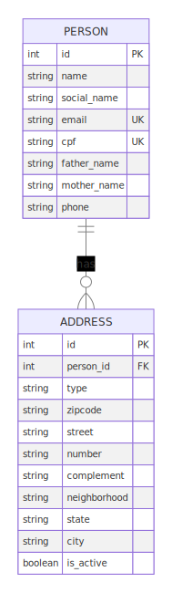
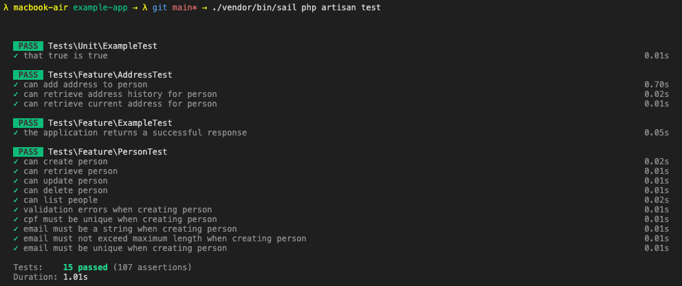
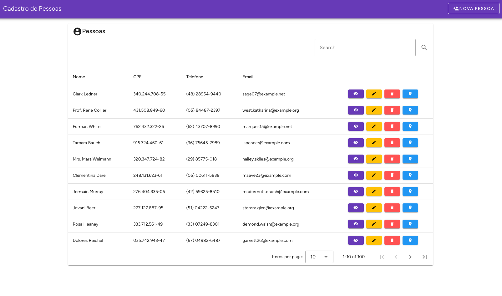

# Cadastro de Pessoas com Laravel & VueJS 🚀

Este projeto é uma API desenvolvida com Laravel, utilizando Laravel Sail para facilitar a configuração e execução em ambientes Docker 🐳. O foco está em fornecer uma solução eficiente para o cadastro e gerenciamento de pessoas 🧑‍🤝‍🧑, acompanhado de testes de integração para garantir a qualidade e confiabilidade do software 🎯.

## Demonstração 📺
Você pode acessar a aplicação em execução no link https://cadastros.billy.dev.br

## Tecnologias Utilizadas 🛠️
- [Laravel](https://laravel.com/)
- [VueJS](https://vuejs.org/)
- [Vuetify](https://vuetifyjs.com/)
- [MySQL](https://www.mysql.com/)

## Pré-requisitos ✅

- Docker / Docker Desktop / Docker Engine e Docker Compose 🐳
- Composer 
- Node.js (Versão mais recente)

**Importante:** Laravel Sail utiliza a porta `3306` para o MySQL por padrão. Certifique-se de que esta porta esteja disponível 🚦 ou ajuste a configuração conforme necessário.

## DRE - Diagrama de Relacionamento de Entidades 📊
Abaixo está o diagrama de relacionamento de entidades do projeto:
<p align="center">
  
</p>

## Como Clonar o Projeto 📋

Para clonar o projeto, abra um terminal e execute o seguinte comando:

```bash
git clone https://github.com/billyfranklim1/cadastro-pessoas-laravel-vuejs.git 
```

🎉 Após clonar o repositório, entre no diretório do projeto:

```bash
cd cadastro-pessoas-laravel-vuejs
```

## Configuração Inicial 🔧

Copie o arquivo `.env.example` para `.env` para configurar o ambiente:

```bash
cp .env.example .env
```

Execute o comando abaixo para instalar as dependências do Laravel:

```bash
composer install --ignore-platform-reqs
```

Inicie os contêineres Docker com Laravel Sail 🐳:

```bash
./vendor/bin/sail up --build
```

Gere a chave da aplicação Laravel 🔑:

```bash
./vendor/bin/sail artisan key:generate
```

Execute as migrações para criar as tabelas no banco de dados 🗃️:

```bash
./vendor/bin/sail artisan migrate
```

Se desejar, você pode popular o banco de dados com dados de exemplo executando as seeds:

```bash
./vendor/bin/sail artisan db:seed
```

Ou, se preferir, você rodar o dump SQL que está na raiz do projeto:
    
```bash
dump.sql
```
<!-- add alerta que é aconselhável rodar via migrations e seeds com emojis de atenção -->
## Atenção: 🚨
É altamente recomendável que você execute as migrações e seeds para garantir que o banco de dados esteja configurado corretamente. O dump SQL é fornecido apenas como uma alternativa para popular o banco de dados com dados de exemplo.

## Configuração do Front-end 🖥️

Para configurar o front-end, abra um novo terminal e execute o seguinte comando:
    
```bash
    ./vendor/bin/sail npm install
```

e depois:

```bash
    ./vendor/bin/sail npm run dev
```

## Como Rodar os Testes 🧪

Execute os testes de integração com:

```bash
./vendor/bin/sail artisan test
```

Se tudo estiver configurado corretamente, você verá a saída dos testes no terminal semelhante à imagem abaixo:
<p align="center">
  
</p>


## Acessando a Aplicação 🌐

A API estará acessível através do `http://localhost:80`.

Se tudo estiver configurado corretamente, você verá a página inicial como a imagem abaixo:
<p align="center">
  
</p>

## Possíveis Erros e Soluções 🛠️

- **Erro**: Porta `3306` já está em uso 🚫.
  - **Solução**: Verifique se nenhum outro serviço está usando a porta `3306`. Se necessário, ajuste a porta no seu arquivo `.env` e `docker-compose.yml`.

- **Erro**: Permissões ao executar o Sail ⚠️.
  - **Solução**: Execute os comandos do Sail com `sudo` ou adicione seu usuário ao grupo Docker.

## Contribuindo 🤝

Sinta-se à vontade para contribuir com o projeto. Abra uma issue ou envie um pull request com suas sugestões e melhorias.

## Licença 📝

Este projeto está licenciado sob a [Licença MIT](LICENSE).
